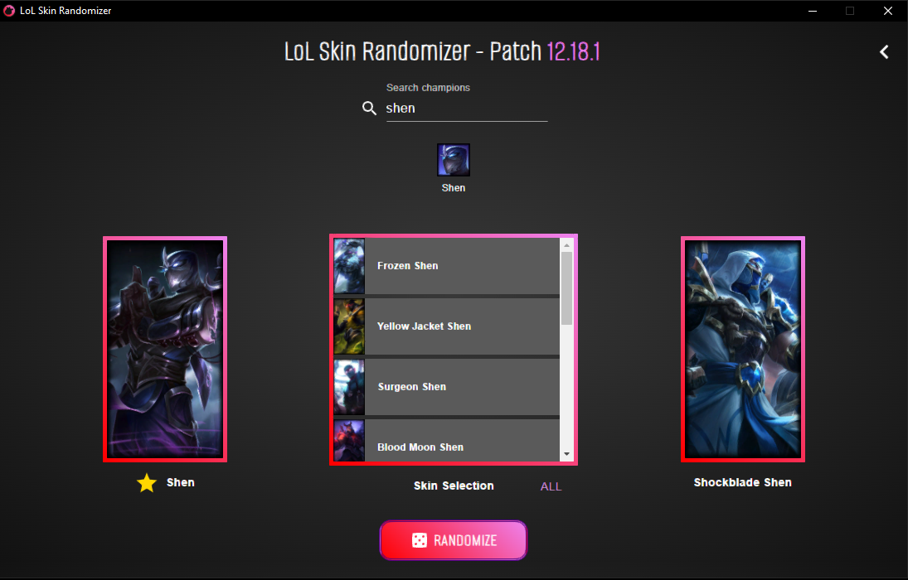

# LoL Skin Randomizer

Application to input your owned League of Legend skins and choose a random skin based on the selected champion. Uses the League of Legends ddragon for champion images and data. Built with React and Electron.

## Usage

### Browser

Clone the repository. In the project directory, run

> `npm run start`

to launch the project in a browser window. Go to `http://localhost:3000` to open the application.

### Electron

In the projcet directory, run

> `npm run start`

in one console window, and in another console window, run

> `npm run dev`

to launch the application as an Electron client.

## Features

Option to include default skins in random roll. Click the star button to favorite champions for easy access on the sidebar. Saved skins and favorited champions are persisted on exit.

